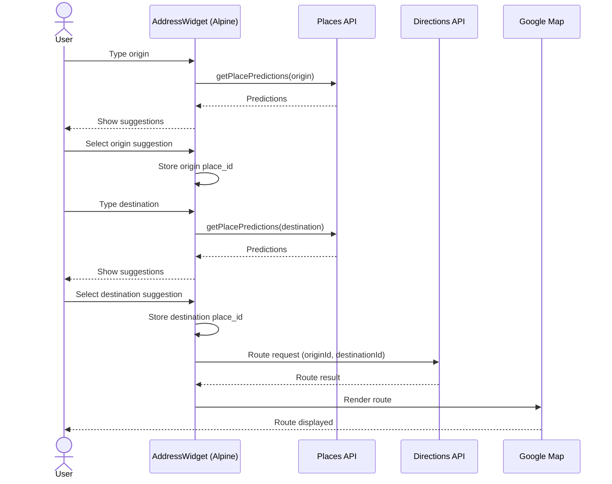

import Tabs from '@theme/Tabs'
import TabItem from '@theme/TabItem'

# Interactive Address Fields 

This page documents the frontend-only address and route widget used on Trip details: a pair of typeahead address fields that draw a route on a Google Map. It’s implemented as a reusable [Django Cotton] component, styled with [Tailwind CSS] and [DaisyUI], and powered by [Alpine.js] and the [Google Maps JavaScript API] (Places + Directions).

Key points:
- Purely frontend: no model writes or server calls are required for suggestions or routing.
- Two inputs (origin/destination) use Places Autocomplete to get predictions client-side.
- When both addresses are selected, Directions Service renders a route on the map.
- The component is a Cotton tag: `<c-address-route />`.

> Backend integration plan: this UI will later submit normalized values (place_id, formatted_address, lat/lng) to our Trip model fields, formatted to the Google Places API data shape.

---

## Where it lives

- Cotton component template: `src/server/lib/dashboard/templates/cotton/address_route.html`
- Included in Trip details partial: `src/server/lib/core/templates/core/trips/partials/details.html`

You can embed it anywhere via the Cotton tag:

```django-html
<c-address-route api-key="{{ GOOGLE_MAPS_API_KEY }}" />
```

Cotton resolves `<c-address-route />` to `dashboard/templates/cotton/address_route.html`. The optional `api-key` attribute lets you pass a Google Maps API key from Django.

---

## Dependencies and links

- Django Cotton (component templates): https://github.com/synw/django-cotton
- Tailwind CSS (utility CSS): https://tailwindcss.com/
- DaisyUI (Tailwind component library): https://daisyui.com/
- Alpine.js (lightweight reactivity): https://alpinejs.dev/
- HTMX (already present in app, optional for future server interop): https://htmx.org/
- Google Maps JavaScript API (Places, Directions): https://developers.google.com/maps/documentation/javascript/overview

---

## Environment variables (Google Maps API key)

Set a `GOOGLE_MAPS_API_KEY` for development and production. Two common approaches:

<Tabs>
	<TabItem value="makefile" label="Makefile sourced .env">

Keep `src/server/.env` with:

```env
GOOGLE_MAPS_API_KEY=your_key_here
```

Source it in commands executed from `src/server`. For zsh Makefiles you can do:

```makefile
SHELL := /bin/zsh
DOTENV := set -a; source .env; set +a;

server-run:
	cd src/server && $(DOTENV) uv run lib/main.py vite runserver
```

Then pass to templates via a context processor (already wired):

```python title="lib/app/context.py"
def maps_api_key(request):
		return {"GOOGLE_MAPS_API_KEY": os.getenv("GOOGLE_MAPS_API_KEY", "")}
```

	</TabItem>
	<TabItem value="dotenv" label="python-dotenv in Django">

Install `python-dotenv` and load `.env` from `settings.py`:

```python
from dotenv import load_dotenv
load_dotenv(BASE_DIR / ".env")
```

Now `os.getenv("GOOGLE_MAPS_API_KEY")` is available at runtime.

	</TabItem>
</Tabs>

The component will use either the passed `api-key` prop or a global `window.GOOGLE_MAPS_API_KEY`. In our app we prefer the prop, which comes from the template context variable `GOOGLE_MAPS_API_KEY`.

---

## Usage examples

### Basic include in a Django template

```django-html
<!-- e.g., in Trip details partial -->
<c-address-route api-key="{{ GOOGLE_MAPS_API_KEY }}" />
```

### Behavior highlights (Alpine.js state)

```js
// inside the component template
function addressRoute() {
	return {
		originText: '', destinationText: '',
		originPlaceId: '', destinationPlaceId: '',
		originPreds: [], destinationPreds: [],
		map: null, directionsService: null, directionsRenderer: null,

		ensureMapsLoaded(root) { /* injects <script> with API key if needed */ },
		initMap() { /* init map + services */ },
		fetchPredictions(field) {
			// uses google.maps.places.AutocompleteService
		},
		selectPrediction(field, pred) {
			// sets place_id and triggers routing if both ends are chosen
		},
		calculateAndDisplayRoute() {
			// uses google.maps.DirectionsService + DirectionsRenderer
		},
	}
}
```

### Styling (Tailwind + DaisyUI)

Inputs use DaisyUI’s `input input-bordered`, menus use `menu rounded-box`, and the map is a responsive `aspect-video` area. Tailwind utilities keep layout and spacing concise.

---

## Sequence diagram



---

## Why this approach?

- Lightweight and fast: Alpine.js provides reactivity without a heavy framework.
- Clean separation: the UI is a Cotton component you can drop into any template.
- Minimal backend impact: predictions and routing happen client-side; the backend only needs to supply a key.
- Better UX: instant suggestions and immediate route rendering.
- Progressive enhancement: if future needs arise (e.g., logging selections, storing addresses), you can post selected data via HTMX or a standard form.

---

## Frontend-only, prepared for backend integration

Today this is purely frontend. For saving to Trips later, we’ll map selected addresses into a normalized schema aligned with Google Places details:

- `place_id` (string): stable identifier
- `formatted_address` (string)
- `location` (lat/lng)
- Optional: `components` (street, city, region, country, postal code)

Two easy integration patterns:

1) Hidden inputs in a form (submit on Save):

```html
<form method="post">
	
	<c-address-route api-key="{{ GOOGLE_MAPS_API_KEY }}" />
	<input type="hidden" name="origin_place_id" x-model="originPlaceId" />
	<input type="hidden" name="destination_place_id" x-model="destinationPlaceId" />
	<button class="btn btn-primary">Save</button>
	<!-- In the view, fetch place details server-side if needed, then store -->
	<!-- Or send full details as JSON via a hidden field and parse in the view -->
	<input type="hidden" name="route_details_json" :value="JSON.stringify(routeDetails || {})" />
	<!-- routeDetails can be extracted from Directions API response if desired -->
  
</form>
```

2) HTMX partial submit (AJAX to a Django endpoint) to pre-validate or enrich data.

---

## Troubleshooting

- Map doesn’t load: check `GOOGLE_MAPS_API_KEY` is present and the Maps script includes `libraries=places`.
- No predictions: ensure Places API is enabled on the key and key restrictions allow your origin.
- Directions fail: confirm Directions API is enabled and both place_ids are valid.

---

## Security note

Always restrict your Google Maps API key:
- Limit to your domains (HTTP referrers) in production.
- Restrict to required APIs (Maps JavaScript API, Places API, Directions API).

---

## Appendix: Component anatomy (selected snippets)

Loading the script on demand with the provided key:

```js
ensureMapsLoaded(root) {
	this.apiKey = (root?.dataset?.apiKey || window.GOOGLE_MAPS_API_KEY || '').trim();
	if (window.google?.maps?.places) return this.initMap();
	const s = document.createElement('script');
	s.id = 'google-maps-js';
	s.src = `https://maps.googleapis.com/maps/api/js?key=${encodeURIComponent(this.apiKey)}&libraries=places`;
	s.async = s.defer = true;
	s.onload = () => this.initMap();
	document.head.appendChild(s);
}
```

Fetching predictions and rendering the route:

```js
fetchPredictions(field) {
	const text = field === 'origin' ? this.originText : this.destinationText;
	this.autocompleteService.getPlacePredictions({ input: text }, (preds, status) => {
		// update suggestion list
	});
}

calculateAndDisplayRoute() {
	this.directionsService.route(
		{
			origin: { placeId: this.originPlaceId },
			destination: { placeId: this.destinationPlaceId },
			travelMode: google.maps.TravelMode.DRIVING,
		},
		(response, status) => {
			if (status === 'OK') this.directionsRenderer.setDirections(response);
		}
	);
}
```

---

If you have questions or want to extend the component (multi-waypoints, travel mode selector, distance matrix), open a ticket in the repo.

[Django Cotton]: https://github.com/synw/django-cotton
[Tailwind CSS]: https://tailwindcss.com/
[DaisyUI]: https://daisyui.com/
[Alpine.js]: https://alpinejs.dev/
[Google Maps JavaScript API]: https://developers.google.com/maps/documentation/javascript/overview
